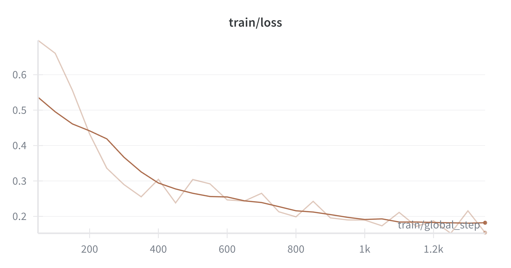
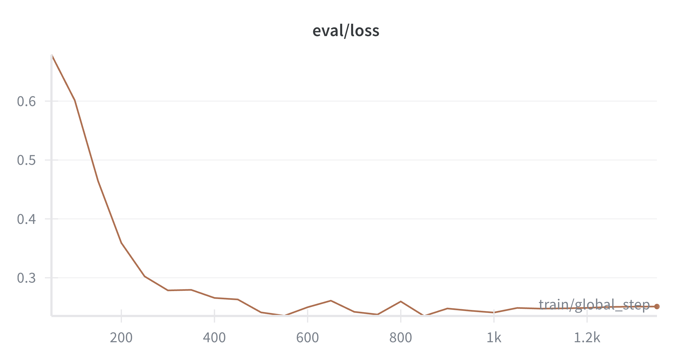
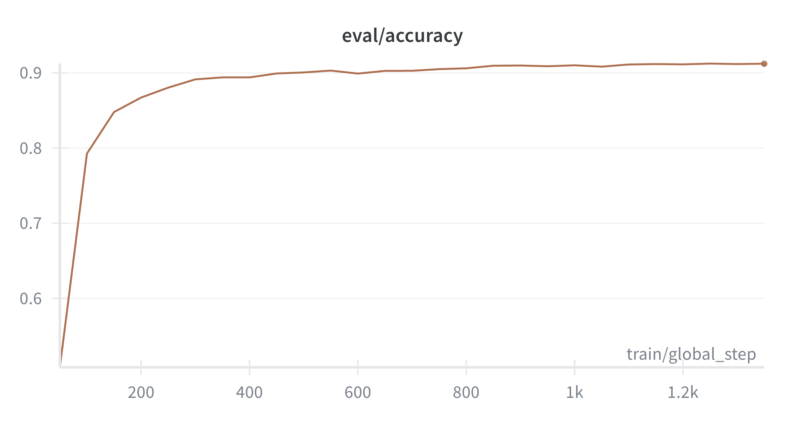
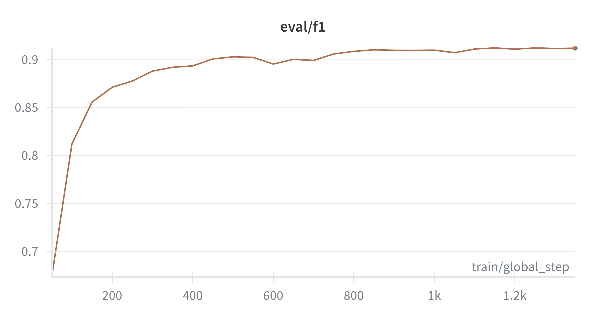

# BERT Fine-tuning for Claim Detection

This project fine-tunes **BERT-base-uncased** on a public claim detection dataset using the **Hugging Face Transformers** library.  
The goal is to classify whether a sentence is a *check-worthy statement* (i.e., worth verifying).
> 🚀 **Highlights**  
> - Fine-tuned `bert-base-uncased` achieving **91% accuracy / F1** on claim detection task  
> - Fully reproducible Hugging Face training pipeline with W&B tracking  
> - Deployed as a **Dockerized microservice**, ready for Spring Boot / enterprise integration  
> - Includes **manual training loop** for research transparency and model interpretability  
> - Future work: domain adaptation to **insurance claim automation**
---

## Huggingface Hub
The model was pushed to the Hugging Face Hub for wider community use and integration.
[Link to model](https://huggingface.co/XiaojingEllen/bert-finetuned-claim-detection)

You can use the model directly in Python:
```python
from transformers import pipeline

classifier = pipeline("text-classification", model="XiaojingEllen/bert-finetuned-claim-detection")
classifier("The government increased healthcare costs by 10% last year.")
```

## Dataset

- **Name**: [Claim Detection Dataset (Hugging Face)](https://huggingface.co/datasets/Nithiwat/claim-detection)
- **Language**: English  
- **Task type**: Binary classification (`claim` / `non-claim`)  
- **Split**: 11k train / 7k validation  

## Model Description

| Property | Description                                      |
|-----------|--------------------------------------------------|
| **Model Type** | BERT (base, uncased)                             |
| **Downstream Task** | Claim Detection / Checkworthiness Classification |
| **Language** | English                                          |
| **Framework** | PyTorch + Hugging Face Transformers              |
| **Base Model Source** | `bert-base-uncased`                              |
| **Fine-tuning Dataset** | `Nithiwat/claim-detection`                       |
| **Fine-tuning Epochs** | 2                                                |
| **gradient_accumulation_steps** | 1                                                |
| **Batch Size** | 16                                               |
| **total_train_batch_size** | 16                                               |
| **Learning Rate** | 2e-5                                             |
| **Optimizer** | AdamW                                            |
| **Scheduler** | cosine                                           |
| **Scheduler Warmup Steps** | 400                                              |
| **Training Log** | Integrated with Weights & Biases (`wandb`)       |


## Training & Evaluation Details

Training and evaluation were conducted using the Hugging Face `Trainer` class with 
custom metric computation (Accuracy and F1-score).  
The model was fine-tuned on 11,000 training samples and evaluated on the full test split.

**Metrics:**

| Metric | Value |
|---------|-------|
| Accuracy | 0.91  |
| F1 (weighted) | 0.91  |
| Train Loss | 0.15  |
| Eval Loss | 0.22  |

> ✅ The fine-tuned model achieves **91% accuracy and F1** on the validation set, demonstrating strong semantic understanding for claim detection.

---

## Training Curves


| Training loss                                                                                               | evaluation loss                                                                                            |
|-------------------------------------------------------------------------------------------------------------|------------------------------------------------------------------------------------------------------------|
|  |  |

| evaluation accuracy                                                                                                | evaluation F1                                                                                                |
|--------------------------------------------------------------------------------------------------------------------|--------------------------------------------------------------------------------------------------------------|
|  |  |

## Getting Started

### Environment Setup
```bash
git clone https://github.com/EllenLiu2019/bert-finetune.git
cd bert-finetune
docker build -t claim-detection-service:latest .
docker run -it 8000:8000 claim-detection-service:latest
```
Please make sure to replace the port number with the one you used when running the docker container, then you can access the service at [Swagger UI](http://localhost:8000/docs). 


This model can be integrated into:
- **Spring Boot** backends for real-time inference
- **LangChain / LangGraph** pipelines for claim reasoning and document validation
- **MLOps** deployment on cloud platforms (eg: AWS Sagemaker)

## Interpretation
What the model learns: semantic and syntactic cues that indicate factual assertions.
### Potential applications:
* Detect “fact-check-worthy” claims in political or news text.
* Pretraining stage for insurance claim text classification (transfer to claim legitimacy or fraud detection).
* Fine-tune on insurance domain corpus for claim / underwriting automation.

##  Additional Experiments

### Manual Training Loop (Full Training Loop)
In addition to the standard fine-tuning using the Trainer API, 
a full training loop (`notebooks/full_loop_experiment.ipynb`) was also implemented from scratch to gain a deeper understanding of the optimizer behavior, 
gradient clipping, and scheduling strategies.

This notebook manually defines:
- Custom DataLoader
- Gradient accumulation and optimization steps
- Switching between optimizers and schedulers and manual metric calculation

The manually implemented training loop achieved:

| Metric | Value |
|---------|-------|
| Accuracy | 0.91  |
| F1-score | 0.91  |

The training process demonstrates stable convergence behavior.
This experiment provided valuable insights into optimization stability, 
loss curve behavior, and model convergence control.

### BERT Architecture Reproduction
For educational completeness, the repository also includes 
`notebooks/bert_from_scratch`, which implements the Transformer encoder and masked LM logic from scratch.

## Next Steps
1. Adapt model to insurance domain using labeled claim descriptions.
2. Integrate with LangChain / LangGraph for explainable claim verification pipelines.
3. Deploy Spring Boot backend to simulate enterprise AI integration.

